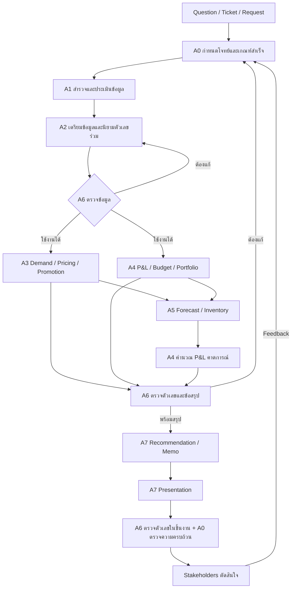

# Workflow และแผน agent สำหรับ FruitBlend24

สถานะ: ตรวจโจทย์และข้อมูลจริงแล้ว จัดทำแบบการทำงานและข้อกำหนด agent พร้อมนำไปใช้ ยังไม่ได้เปิด agent อัตโนมัติหรือทำบทวิเคราะห์ธุรกิจครบทั้งเคส

## 1. ข้อสรุปเรื่องโครงสร้างเดิม

โครงสร้าง Question → Gather → Clean → Analyze → Present → Memo → Stakeholders เหมาะเป็นภาพรวม แต่ควรปรับให้รองรับงานนี้ดังนี้

1. เพิ่ม **Frame the question** ก่อน Gather เพื่อระบุการตัดสินใจ นิยามตัวเลข และเกณฑ์ส่งงาน
2. ในเคสนี้ Gather คือรวบรวมและตรวจตารางใน workbook ก่อน ไม่จำเป็นต้องหาข้อมูลจากภายนอกเป็นจุดเริ่มต้น
3. เพิ่ม **Build shared metrics / P&L** หลัง Clean เพราะโจทย์ไม่มี P&L สำเร็จรูป และทุก agent ต้องใช้ตัวเลขชุดเดียวกัน
4. แยก Analyze เป็นงาน demand/pricing/promotion และ finance/portfolio ซึ่งเริ่มขนานกันได้หลังข้อมูลผ่านการตรวจ
5. เพิ่ม **Forecast & Inventory** เป็นงานชัดเจน ครอบคลุมโจทย์ข้อ 5 และส่ง forecast กลับไปคำนวณ P&L
6. มี QA ทั้งหลังเตรียมข้อมูลและก่อนส่งมอบ พร้อมเส้นทางย้อนแก้ไข
7. ร่าง **Recommendation / Memo ก่อน Present** เพื่อให้การเลือกกราฟสนับสนุนการตัดสินใจ จากนั้นตรวจทั้ง memo และ presentation รอบสุดท้าย
8. รับ feedback จาก stakeholders เพื่อกลับไปแก้คำถาม สมมติฐาน หรือการวิเคราะห์ โดยไม่ต้องรันใหม่ทุกอย่าง



## 2. ผลตรวจข้อมูลที่มีผลต่อการออกแบบ

แหล่งโจทย์: `question/test.md` ข้อ 3–6 แหล่งข้อมูล: `data/raw/FruitBlend24_Intern_Case_Data.xlsx` ผลตรวจแบบรันซ้ำได้: `planning/data_readiness.json`

| สิ่งที่ตรวจพบ | ผลต่อ workflow |
|---|---|
| orders_hourly มี 124,397 แถว ครอบคลุม 1 ก.ย. 2025–31 ส.ค. 2026 | ช่วงพยากรณ์ถัดจากข้อมูลคือ ก.ย.–พ.ย. 2026 แม้ว่าวันที่ทำงานจะอยู่ระหว่างเดือน ก.ย. |
| ชื่อสินค้าดิบ 31 รูปแบบ และแถวซ้ำเหมือนกันทุกช่องส่วนเกิน 372 แถว | เก็บ source row ID, mapping ชื่อสินค้า และบันทึกการตัดแถวซ้ำ |
| หลังตัดซ้ำมีรายการนอก 5 เมนูหลัก 370 แถว: เมนูทดลอง 134, Combo 122, แก้วเปล่า 114 | แยกเป็นตารางข้อยกเว้นพร้อมยอดเงิน ห้ามรวม Combo เป็นสินค้าเดี่ยวโดยเดา |
| หลังทดลอง mapping และแยกข้อยกเว้น เหลือ 123,655 แถว | เป็นผลสำรวจเบื้องต้น ยังไม่ใช่ clean data ที่อนุมัติใช้งาน ต้องกระทบยอดทั้งแถว จำนวนแก้ว และรายได้ |
| ไม่พบข้อมูลว่างใน orders, วันที่/ชั่วโมงผิด, weekday ผิด หรือ revenue ต่างจาก units × price เกิน 0.01 บาท | ใช้เป็นหลักฐานเฉพาะ checks เหล่านี้ ไม่ใช่ข้อยืนยันว่าข้อมูลไม่มีปัญหาอื่น |
| หลังทดลองเตรียมข้อมูล ไม่พบแถวซ้ำที่ date × hour × kitchen × SKU | grain ที่พบเป็นระดับนี้ โดย platform/promo อยู่ใน rate_code ไม่ใช่ order/customer รายคน |
| price_thb รวมส่วนลดแล้ว และข้อมูลเมนูหลักตรงกับ base_price × (1 − discount) ภายใน 0.01 บาท | ห้ามหักส่วนลดอีกครั้ง และยังไม่มี variation ราคาอิสระจากโปรโมชันเพียงพอให้ยืนยัน causal price elasticity |
| MixedBerryPremium เปิดขาย 1 มี.ค. 2026 | ใช้ประวัติหลังเปิดตัวประมาณ 6 เดือน ห้ามเติมช่วงก่อนเปิดตัวเป็น demand ศูนย์ |
| ต้นทุน MixedBerryPremium เริ่ม 2 มี.ค. 2026 แต่วันเปิดตัวอยู่ในสัปดาห์ 23 ก.พ. | ยอดขาย 75 แถวไม่มีต้นทุนที่ตรงสัปดาห์ ต้องติดธงและวัดผลกระทบ |
| waste วันเปิดตัวของ MixedBerryPremium ว่างในช่องต้นทุน 4 แถว รวม 96 แก้ว | ห้ามปล่อยให้ sum ข้ามค่าว่างแล้วรายงานต้นทุนต่ำเกินจริง |
| waste เป็นข้อมูลรายวัน ส่วน overhead เป็นรายเดือนต่อครัว | รวมยอดขายให้ grain ตรงกันก่อน join และหัก overhead ครัวละ 1 ครั้งต่อเดือน |
| budget เป็นยอดรวมบริษัท และไม่ได้ระบุนิยาม gross profit ชัดเจน | เปรียบเทียบระดับบริษัทก่อน การแยก budget ลงสินค้า/ครัวต้องระบุว่าเป็นการจัดสรรสมมติ |

ข้อจำกัดจาก schema: ไม่มี customer ID, order ID, stock on hand, stockout, BOM/สูตรวัตถุดิบ, lead time, shelf life และใบสั่งซื้อ จึงยังวัด retention/CAC/LTV ไม่ได้ และยังออกใบสั่งซื้อเป็นกิโลกรัมจริงไม่ได้

## 3. จับคู่โจทย์กับข้อมูลและเจ้าของงาน

| โจทย์ | ข้อมูลหลัก | Agent | ผลส่งมอบและข้อจำกัด |
|---|---|---|---|
| 1. Data quality | ทุก sheet โดยเน้น orders และ dimensions | A1 → A2 → A6 | issue log, mapping, exclusions, reconciliation, clean data ที่มี version |
| 2. Demand & pricing | ยอดขายสะอาด, base price, cost, commission | A3 | demand ตามเวลา/ครัว/SKU, realized price, contribution ต่อแก้ว, ราคา/ปริมาณคุ้มทุน และแผนทดลองราคา |
| 3. Promotions | rate_code_dim, platform_dim, sku_code_dim และยอดขาย | A3 | ผลราย promo ต่อรายได้และ contribution พร้อม comparator; ไม่สรุป uplift เชิงเหตุผลจากยอดขายช่วงโปรล้วน ๆ |
| 4. Portfolio & budget | orders, weekly cost, commission, waste, assumptions, budget | A4 | P&L รายเดือน/ครัว/SKU และ budget variance ระดับบริษัท; แยก contribution จาก overhead allocation |
| 5. Inventory & 3-month outlook | daily sales, waste, ผล A3 และ P&L ฐานจาก A4 | A5 → A4 | forecast ก.ย.–พ.ย. 2026, แผนเตรียม/เติมสินค้าในหน่วยแก้ว, P&L 3 scenarios และข้อสมมติ |
| 6. Present | ผลที่ A6 ตรวจแล้วจากทุกสาย | A7 → A6 → A0 | 3–5 insights, ≥3 recommendations ครอบคลุมราคา portfolio inventory และไฟล์คำนวณที่รันซ้ำได้ |

## 4. Agent ที่แนะนำ: 8 บทบาท

| ID | บทบาท | รับงาน | ส่งงาน | เกณฑ์เสร็จ |
|---|---|---|---|---|
| A0 | Orchestrator / ผู้คุมโจทย์ | โจทย์, feedback, ข้อขัดแย้ง | task brief, assumptions, dispatch, decision log | ครบ 6 tasks, ทุกคำแนะนำมีหลักฐานและผู้รับผิดชอบ |
| A1 | Data Auditor | workbook ดิบและ dictionary | data inventory, quality report, รายการข้อมูลขาด | ระบุ grain, keys, date coverage และปัญหาที่กระทบคำตอบ |
| A2 | Data Preparation & Metrics | ผล audit และนิยามจาก A0 | clean tables, mapping, metric contract, reconciliation | join ไม่เพิ่มยอด, ไม่เหลือ unknown cost ที่ถูกนับเป็นศูนย์, ย้อนถึง raw ได้ |
| A3 | Commercial Analyst | clean data ที่ผ่าน A6 | demand, pricing, promo findings, scenario drivers | ทุก claim มี metric/period/comparator และแยก association จาก causation |
| A4 | Finance & Portfolio Analyst | clean data, cost policy, budget; ต่อมารับ forecast A5 | historical P&L, portfolio, budget variance, projected P&L | กำไรทุกระดับกระทบยอด และใช้ finance logic เดียวกันใน actual/forecast |
| A5 | Inventory & Forecast Analyst | daily series, waste, demand drivers, finance baseline | forecast, backtest, cup-based replenishment policy, scenario inputs | ไม่ใช้ข้อมูลอนาคตใน backtest และเปิดเผยข้อมูลสต็อกที่ขาด |
| A6 | Independent QA | แหล่งข้อมูล + ผลของ agent อื่น | review findings และผลตรวจรอบแก้ไข | ตรวจคำนวณสำคัญอย่างอิสระ รวมถึงตัวเลขที่ใช้ใน memo/กราฟ |
| A7 | Decision & Presentation | ผลที่ผ่าน QA | memo, charts, presentation, methodology | 3–5 insights และคำแนะนำที่มี action/owner/KPI/timing/evidence |

เป็น 8 บทบาท ไม่จำเป็นต้องเปิด 8 processes พร้อมกัน สำหรับเคส 7 วัน ให้มีผู้คุมงาน 1 ตัว และผู้ปฏิบัติงานพร้อมกันเท่าที่ dependency อนุญาต โดยเฉพาะ A3 กับ A4 ส่วน A6 ต้องแยกผู้ตรวจจากผู้สร้างผล

ข้อกำหนดและ prompt สำหรับแต่ละบทบาทอยู่ใน `planning/agent_blueprints.th.md`

## 5. นิยามข้อมูลและตัวเลขที่ต้องใช้ร่วมกัน

### Grain และ join

- `sales_hourly`: date, hour, kitchen, canonical SKU พร้อม platform/base promo/SKU suffix ที่ถอดจาก rate_code; เก็บ raw_name และ source_row_id
- `fruit_cost_weekly`: Monday week_start × SKU; join แบบ many-to-one และตรวจ unmatched ทุกครั้ง
- `sales_daily`: date × kitchen × SKU; รวมจาก hourly ก่อนจับคู่ `waste_daily` ที่ grain เดียวกัน
- `kitchen_monthly`: month × kitchen; หัก overhead เพียงครั้งเดียวแล้วรวมเป็น company monthly
- `budget_monthly`: month ระดับบริษัท; join หลังรวม actual ถึงระดับเดียวกัน
- platform ไม่ใช่มิติของ waste; หากต้องจัดสรร waste ลง platform ต้องมี rule และรักษายอดรวม
- ชั่วโมงที่ไม่มีแถวไม่เท่ากับ demand ศูนย์โดยอัตโนมัติ ต้องมี coverage rule และแยกช่วงก่อนเปิดตัว

### ตัวเลขแกนกลาง

```text
sales_revenue = sum(units_sold × observed_price)
sold_fruit_cost = sum(units_sold × matched_weekly_fruit_cost)
sold_packaging_cost = sum(units_sold × packaging_per_cup)
sold_labor_cost = sum(units_sold × labor_per_cup)
commission = sum(sales_revenue_row × platform_commission_rate)
product_margin = sales_revenue − sold_fruit_cost − sold_packaging_cost − sold_labor_cost
contribution_before_waste = product_margin − commission
contribution_after_waste = contribution_before_waste − waste_cost
modeled_operating_result = contribution_after_waste − kitchen_monthly_overhead
```

- `gross_revenue_thb` ในไฟล์คือรายได้หลังส่วนลดและก่อน commission ตาม dictionary ชื่อคอลัมน์ไม่ควรทำให้หักส่วนลดซ้ำ
- waste_cost ที่ให้มารวม fruit + packaging เท่านั้น ต้องไม่หักสองส่วนนี้ซ้ำสำหรับแก้วที่ทิ้ง ค่าแรงของเสียยังไม่มีนิยามชัด ให้ระบุขอบเขตที่ใช้
- budget gross profit ยังไม่มี cost boundary: แสดง product margin และ contribution แยกชัด หากใช้ contribution_after_waste เป็น GP สำหรับเคส ให้เขียนว่าเป็น assumption และแสดงความไวของข้อสรุป ห้ามประกาศว่า budget variance ยืนยันแล้วถ้านิยามยังไม่ตรงกัน
- labor per cup กับ base staffing ใน overhead ต้องบันทึกสมมติฐานว่าเป็นค่าแรงคนละส่วนตามแบบข้อมูล หากมีการตีความอื่นให้ทดสอบผลกระทบ
- modeled operating result เป็นกำไรตามรายการที่มีในเคส ไม่ใช่กำไรสุทธิหลังภาษีที่ตรวจสอบแล้ว
- ใช้ weighted average เช่น realized_price = total_revenue / total_units ไม่เฉลี่ยราคาหรือ margin percentage แบบไม่ถ่วงน้ำหนัก
- waste rate เพื่อการวางแผน = wasted_cups / (sold_cups + wasted_cups) โดยระบุว่า denominator นี้สมมติยอดเตรียมไม่มีการยกยอดที่ต้องปรับ

### นโยบายข้อมูลขาดสำหรับต้นทุนวันเปิดตัว

เก็บค่า raw ที่ขาดไว้ พร้อม estimated value และเหตุผลแยกคอลัมน์ ทางเลือกตั้งต้นที่ใช้เดินหน้าวิเคราะห์ได้คือใช้ต้นทุน MixedBerryPremium สัปดาห์แรกที่มี (2 มี.ค.: 33.69 บาท/แก้ว) เป็น proxy ของ 1 มี.ค. พร้อม sensitivity จากช่วงต้นทุนใกล้เคียง ไม่ถือเป็นต้นทุนจริงที่ยืนยันแล้ว และไม่ใช้ค่าจากอนาคตของแต่ละ cutoff ในการ backtest

ของเสีย 4 แถวอาจประมาณเป็น units_wasted × (proxy fruit cost + packaging 8 บาท) ภายใต้สมมติฐานเดียวกัน ต้องบอกรวมยอดต้นทุนที่ประมาณ และผลต่อกำไร รายงานเปรียบเทียบกรณีใช้ proxy กับช่วง sensitivity

## 6. ลำดับรันและเงื่อนไขส่งต่อ

1. **A0 → A1:** ตั้งคำถามทางธุรกิจ, ช่วงเวลา, ผลส่งมอบ, นิยามและข้อสมมติที่ต้องเปิดเผย
2. **A1 → A2:** ส่ง audit และ candidate mappings รวมข้อยกเว้นที่ยังไม่มีคำตอบ
3. **A2 → A6:** ปล่อย data version พร้อม hash, row/revenue bridge, join checks และ assumption ledger
4. **ผ่าน QA ข้อมูลแล้ว → A3 และ A4 ขนานกัน:** อ่าน data version เดียวกัน ใช้ definition version เดียวกัน และเขียนคนละโฟลเดอร์
5. **A3 + P&L ฐานของ A4 → A5:** กำหนด scenario การเปลี่ยนราคา/โปร/portfolio และคาดการณ์จำนวนขาย/ของเสีย
6. **A5 → A4:** ใช้ forecast drivers คำนวณ projected P&L ด้วย cost logic เดียวกับ historical P&L ไม่มีวงจรที่ forecast รอ projected P&L ของตัวเอง
7. **ทุกสาย → A6:** ตรวจ claim, reconciliation, sensitivity, forecast leakage และการนับผลประโยชน์ซ้ำ
8. **A7 → A6 → A0:** เขียน recommendation/memo ก่อนจัด presentation แล้วตรวจตัวเลขบนชิ้นงานและ checklist ส่งงาน
9. **Stakeholder feedback → A0:** เปิด task เฉพาะส่วนที่ต้องเปลี่ยน และ invalidate เฉพาะผลลัพธ์ downstream ที่ใช้ข้อมูล/สมมติฐานนั้น

QA ส่งกลับเจ้าของไฟล์พร้อมวิธีทำซ้ำและ expected/actual values หากเป็นนิยามธุรกิจที่ข้อมูลตอบไม่ได้ ให้ A0 บันทึกสมมติฐานและระดับข้อจำกัด ไม่ให้ agents เดาแตกต่างกันเอง

## 7. Forecast และ inventory ที่ข้อมูลรองรับ

- เริ่มด้วย daily demand ต่อ kitchen × SKU แล้วรวมเป็นเดือน หลีกเลี่ยงโมเดลซับซ้อนก่อนมี baseline
- เปรียบเทียบ seasonal-naive รายสัปดาห์กับ weekday average/median จาก 4–8 สัปดาห์ก่อน cutoff; เลือก window ด้วย validation เท่านั้น
- ทำ rolling-origin backtest ที่หลาย cutoff และรายงานอย่างน้อย MAE กับ WAPE รวมถึง bias; หาก denominator เป็นศูนย์ ให้รายงาน metric ที่นิยามได้แทน
- ทดสอบ horizon ใกล้ 3 เดือนเมื่อประวัติพอ สินค้าใหม่ต้องแยกความไม่แน่นอนจากสินค้าที่มี 12 เดือน
- ใช้ 3 scenarios: ฐาน / demand ต่ำหรือต้นทุนสูง / แผนปรับราคา-โปร-ของเสีย โดยให้ค่าตั้งต้นมีที่มา ไม่ใช้เปอร์เซ็นต์ uplift ที่แต่งขึ้นเป็นผลคาดการณ์หลัก
- ทำ cup-equivalent requirements ต่อวัน/ครัว/SKU ก่อน แยก sales forecast, prep target, expected waste, ending inventory และ order quantity
- หลักการเติม: `order_qty = max(0, target_stock − usable_on_hand − usable_inbound + committed_demand)` โดย target_stock ต้องสอดคล้องกับ lead time + review period และ safety stock ที่ไม่ทำให้อายุสินค้าล้น
- เนื่องจากยังขาด on_hand/inbound/lead time/shelf life จึงรายงาน **นโยบายและตารางความต้องการ** พร้อมช่องข้อมูลที่ต้องเติมก่อนสั่งจริง
- ไม่บวกของเสียเดิมทั้งจำนวนแล้วบวก safety stock ซ้ำโดยไม่มี simulation; ไม่แปลงแก้วเป็นกิโลกรัมจนกว่าจะมีสูตรและ yield
- การลด/เลิก SKU หรือปิดครัวต้องแยกต้นทุนที่เลี่ยงได้จริงจาก overhead ที่จัดสรร รวมผลกระทบต่อยอดขายสินค้าอื่น

## 8. การจัดไฟล์และประหยัดโทเคน

รายการต่อไปนี้เป็นโครงสร้างสำหรับ implementation; ณ ตอนนี้มีเฉพาะไฟล์ใน planning และ notebook ตรวจความพร้อม

```text
question/test.md                     โจทย์ต้นฉบับ
data/raw/                           ข้อมูลต้นฉบับ อ่านอย่างเดียว
planning/                           แผน, prompts, ผล audit
notebooks/00_workflow_readiness.ipynb notebook รัน audit และอ่านสรุป
src/                                ฟังก์ชันเตรียมข้อมูลและคำนวณที่ใช้ซ้ำ
data/processed/<data_version>/       ข้อมูลที่ A2 ปล่อยให้ใช้ร่วมกัน
reports/<run_id>/data/               mapping, exceptions, reconciliation
reports/<run_id>/commercial/         A3
reports/<run_id>/finance/            A4
reports/<run_id>/inventory/          A5
reports/<run_id>/qa/                 A6
deliverables/<run_id>/               A7: memo, charts, presentation
```

- ใช้ `.ipynb` เป็นหน้ารัน/อ่านผล และเก็บ logic ที่ใช้ร่วมกันใน `.py` เพื่อไม่ต้องคัดโค้ดซ้ำในหลาย notebook
- notebook ไม่ได้ลดโทเคนอัตโนมัติ สิ่งที่ลดได้คืออ่านโค้ดจากไฟล์ รันด้วย kernel และส่งกลับเฉพาะ summary/errors แทนตารางดิบ
- cache ตาม source hash + code/definition/assumption version ไม่ใช่ดูแค่ว่าไฟล์ผลลัพธ์มีอยู่
- handoff ส่ง path/version, ผลตรวจ, 3–5 findings และคำถามค้าง ไม่ส่ง workbook ทั้งเล่มเข้าบริบททุก agent
- จำกัด context ให้แต่ละ agent เฉพาะ brief, contract, artifact ของ upstream และ prompt ของบทบาทนั้น
- ให้โค้ดคำนวณตัวเลข ส่วน agent เลือกวิธี ตรวจเหตุผล และอธิบายผล
- ผู้เขียนหลักหนึ่งคนต่อไฟล์ หาก shared metric เปลี่ยน ต้องแก้ contract และรันเฉพาะ downstream ที่ได้รับผลกระทบ

## 9. แผน 7 วันและเกณฑ์ส่งมอบ

| วัน | งาน | ผลที่ต้องได้ |
|---|---|---|
| 1 | A0 + A1 กำหนดโจทย์และ audit | task matrix, data inventory, issue/assumption log |
| 2 | A2 + A6 เตรียมข้อมูลและตรวจ | clean version, mapping, reconciliation, shared metrics |
| 3 | A3 กับ A4 | demand/pricing/promo + historical P&L/budget/portfolio |
| 4 | A5 และ A4 | backtest, inventory policy, projected P&L 3 เดือน |
| 5 | A6 ตรวจข้ามงาน และเจ้าของแก้ | ข้อสรุปที่ตรวจสอบแล้ว พร้อม sensitivities |
| 6 | A7 ทำ memo และ presentation | 3–5 insights, ≥3 actionable recommendations |
| 7 | A6 + A0 ตรวจงานและวิธีรัน | ชิ้นงานส่งจริง, analysis files, tools/approach note, next investigations |

รูปแบบส่งที่วางไว้เบื้องต้น: presentation/เอกสารสรุป พร้อม notebook และไฟล์วิเคราะห์แนบ ตามทางเลือกที่โจทย์ยอมรับ หากเลือก Python app แทน ให้ใช้ data/metric layer เดิม ไม่สร้างสูตรธุรกิจอีกชุด

งานถือว่าเสร็จเมื่อครอบคลุม 6 tasks, ตัวเลขสำคัญย้อนถึงข้อมูลได้, ข้อสมมติอยู่ใกล้ผลที่กระทบ, forecast ไม่รั่วข้อมูลอนาคต, ทุก recommendation ระบุ action/owner/KPI/timing และมีวิธีรันซ้ำจาก raw จนถึงผลสุดท้าย
